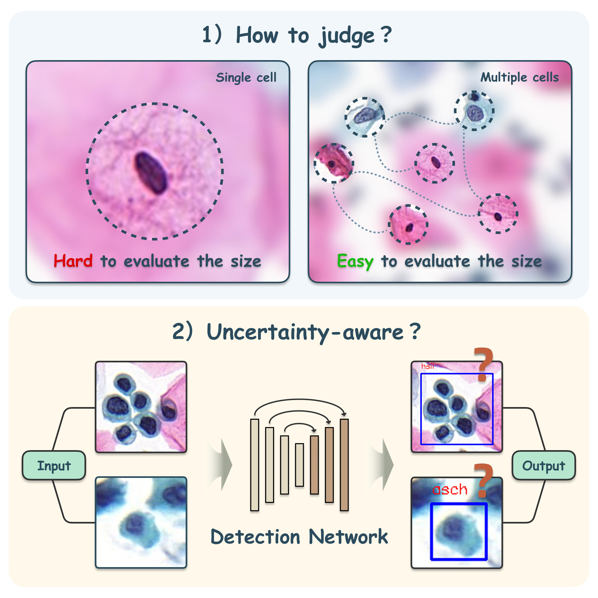

  
   
  <b>Figure.</b> Visualization of Two Unresolved Challenges in Cervical Cell Detection: 1) Unmodeled Visual Correlation Information. 2) Lack of Uncertainty Estimation.

---

# Repository Notice
All source code and datasets for this work have been fully prepared and will be released upon acceptance of the associated paper under an open-source license.

The release will include:

- Full implementation of the proposed methods

- Preprocessing and training scripts

- Processed and/or original datasets (subject to licensing and ethical constraints)

- Detailed documentation for reproducibility

We aim to ensure that our work is fully reproducible and beneficial to the research community.

Thank you for your interest and support!
